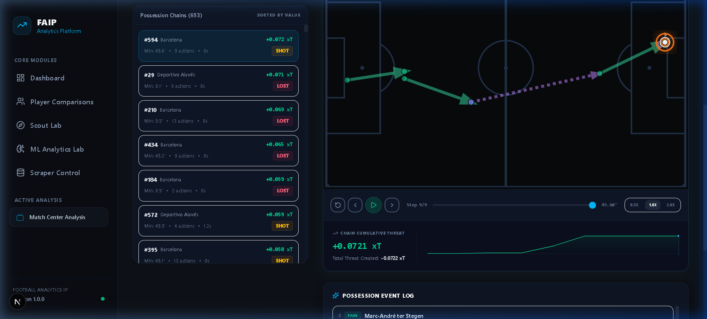
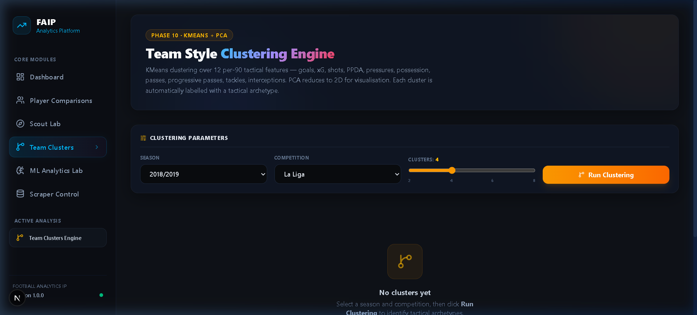
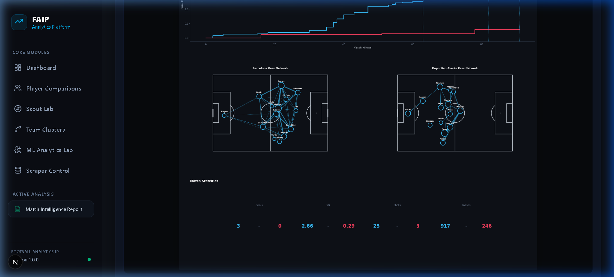
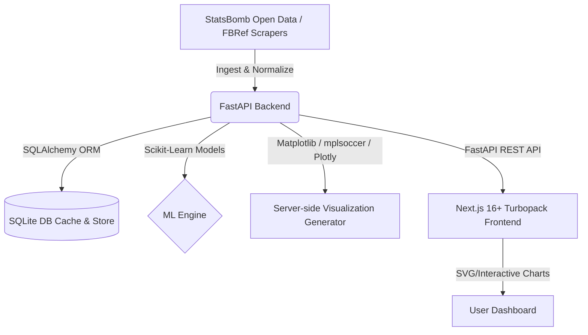

# FAIP: Football Analytics Intelligence Platform ⚽📊

FAIP is a production-grade, end-to-end football analytics platform designed for advanced tactical analysis, player scouting, and match center visualizations. It integrates data engineering pipelines, mathematical modeling (Expected Threat), and machine learning (Expected Goals, clustering, similarity search) into a responsive, glassmorphic dark-themed Next.js dashboard.

**Live Deployment (Frontend):** [faip-football-analytics.vercel.app](https://faip-football-analytics.vercel.app)

---

## 🎥 Demo

Watch the **Possession Chain SVG Flow Visualizer & Playback Engine** in action:
[](https://www.loom.com/share/faip-possession-chain-demo-placeholder)

---

## 📸 Screenshots

Here are key views from the platform:

### 1. Possession Chain SVG Playback Animation
Detailed visualization of possession sequences, showing player passing paths, tactical zones, and cumulative threat timelines over the course of match play.


### 2. Team Style Tactical Clustering (KMeans & PCA Scatter)
Unsupervised machine learning classifications projecting tactical profiles of teams using 12 features down to a 2D space via PCA.


### 3. Comprehensive 6-Panel Match Report Composite
Fully compiled match analytics summary showing shot maps, heatmaps, passing networks, xG timelines, player stats, and automated narrative reports.


---

## 🏗️ System Architecture & Tech Stack



### Backend (`/backend`)
- **Framework:** FastAPI (Python)
- **Database:** SQLite via SQLAlchemy ORM (for caching models, possession chains, scraped player statistics, and team clusters)
- **Scientific Stack:** Scikit-Learn (Logistic Regression, Random Forest, KMeans), Pandas, NumPy, SciPy
- **Graphics/Visualizations:** Matplotlib, mplsoccer, Seaborn, Plotly

### Frontend (`/frontend`)
- **Framework:** Next.js 16.2.7 (Turbopack, App Router)
- **Design System:** Custom CSS-based Dark Glassmorphism
- **Interactive Visualizations:** Responsive SVG overlays, custom timelines, and animated canvas-level playbacks (engineered to minimize heavy external chart library bundle-size overhead)

---

## 🌟 Pitch Visualization Suite (PRD F2)

The system features a comprehensive, server-side visualization generator using `Matplotlib` and `mplsoccer` which serves images encoded in base64 to the Next.js client under 3 seconds:

- **Shot Map:** Proportional scatter plot indicating shot outcomes (Goal, Saved, Blocked, Missed) with sizing scaled to xG. Includes a custom on-pitch key legend.
- **Pass Map:** Vector arrows showing start/end locations colored by outcome (complete in Sleek Sky Blue, incomplete in Crimson Red).
- **Player Heatmap:** Gaussian Kernel Density Estimation (KDE) contour map representing pitch density of touches for any selected player. Falls back to a localized scatter plot when points are fewer than 5.
- **Pass Network:** Average position nodes scaled by total pass frequency before the team's first substitution. Connections represent pairs with 3 or more mutual passes, with arrow thicknesses relative to frequency.
- **xG Timeline:** Cumulative match timeline charting expected goals chronologically. Renders as interactive Plotly JSON with goal annotations containing scorer names and timestamps.
- **Planned Visualizations:** Progressive Pass Maps (highlighting passes advancing possession > 25%), Pressure/Defensive Action Maps (localizing tackles, interceptions, and pressures), and average defensive lines.

---

## ⚙️ Data Engineering & Scraping Pipeline (PRD F3/F7)

The scraper engine operates in the background to harvest player and team metrics from external sources (FBRef):

- **Control Center (`/scraper`):** Provides a visual dashboard to trigger multi-page scraping tasks, check job status, view cached dataset records, and export custom datasets.
- **Multi-Season Ingestion:** Automatically crawl Standard, Shooting, Passing, Passing Types, Goal/Shot Creation (GCA), Defensive Actions, Possession, and Miscellaneous tables.
- **Rate Limiting & Safety:** Implements a strict 3-second request delay between pages and randomized user-agent rotations to respect rate-limiting headers.
- **Cache Freshness Logic:** Employs a 7-day Time-To-Live (TTL). The scraper skips processing if the stored dataset is fresh, unless the `force` query is explicitly passed.
- **Per-90 Normalization:** Performs automated mathematical normalization on ingestion:
  $$\text{Stat}_{per90} = \frac{\text{Stat}_{raw}}{\text{Minutes Played} / 90}$$
  Excludes meta columns, percentiles, and rates.
- **Data Export:** Supports one-click flattening of nested stats tables to download custom parsed CSV files.
- **Security & Seed Backups (403/429 Limits):** Because FBRef employs aggressive bot-detection (frequently returning `403 Forbidden` for direct script requests), the scraping pipeline serves as an architectural template. To facilitate instant local usage, the repository includes a pre-seeded SQLite database containing all parsed event logs and flat player stats.

---

## 📈 Expected Threat (xT) & Advanced Metrics (PRD F3/F8)

### Expected Threat (xT) Grid
Employs Karun Singh's spatial xT value framework utilizing a $12 \times 8$ grid of field zones.
- **Movement Δ-xT:** Computes $\Delta xT = xT_{end} - xT_{start}$ for completed progressive movements (passes, carries, dribbles) to capture possession value.
- **Leaderboards:** Lists players by cumulative threat creation, with a sidebar list of the top 30 key threat-generating events in each match.

### Passes Allowed per Defensive Action (PPDA)
Measures pressing intensity in the attacking 2/3 of the pitch:
$$\text{PPDA} = \frac{\text{Opponent Passes in Opponent's Defensive } \frac{2}{3}}{\text{Defending Team Defensive Actions in Opponent's Defensive } \frac{2}{3}}$$
- **StatsBomb Coordinate Normalization:** In StatsBomb, event coordinates are always oriented such that the active team attacks from left to right ($x=0 \to 120$).
  - For opponent pass events (active possession), the opponent's defensive $2/3$ corresponds to $x \le 80$.
  - For pressing/defending team events (active defending actions), the opponent's defensive $2/3$ maps to the pressing team's attacking $2/3$, corresponding to $x \ge 40$.
- Defensive actions monitored: tackles, interceptions, pressures, challenges, blocks, and fouls committed.

### Coordinate Normalizer (PRD F1.5)
Enforces spatial alignment across multiple data provider coordinate conventions to StatsBomb's $120 \times 80$ standard:
- **StatsBomb:** Native mapping (120 length, 80 width).
- **Opta / WhoScored / SofaScore:** Rescales percentage grid coordinates ($0-100$) to StatsBomb bounds.
- **Tracab:** Shifts and scales metric centimeter values ($[-5250, 5250] \times [-3400, 3400]$) to $[0, 120] \times [0, 80]$.
- **Safety Bounds:** Bounds all parsed coordinates strictly within $[0, 120]$ and $[0, 80]$ to prevent plotting artifacts.

---

## 📊 Modules & Analytical Interfaces

### 🔗 Possession Chain Analyzer (PRD Phase 11)
Segments events into discrete team possession sequences.
- **Termination Rules:** Sequences end on shots, offsides, fouls committed, lost challenges, out-of-play events, or defensive recoveries.
- **SVG Flow Visualizer:** Responsive pitch animating event paths, showing zone heat overlays, and displaying step-by-step cumulative threat timelines.
- **Cache Persistence:** Caches chains in `possession_chains` table with a 24-hour TTL to bypass re-segmentation processing.

### 🌐 Team Style Tactical Clustering (PRD Phase 10)
Clusters teams using unsupervised KMeans across 12 normalized tactical features (possession, passing volume, PPDA, box entry rates, shot frequencies, etc.).
- **Archetype Profiling:** Maps centroids to tactical patterns: *High Pressing*, *Possession Dominant*, *Counter-Attack*, *Low Block*.
- **PCA Dimensionality Reduction:** Projects multidimensional vectors onto a 2D scatter space.

### 🔍 Player Analysis & similarity (PRD F4/F9)
- **Scout Lab (`/scout`):** Employs standardized Cosine Similarity across 15 per-90 metrics to rank similar players.
- **Radar Charts:** Renders custom overlay radar plots comparing percentiles against positional peer groups.
- **Comparison Scatter (`/compare`):** Maps any two metrics (e.g. xG vs xAG) across all players with min-minutes filters and highlighted player overlays.

---

## 🗂️ Frontend Routes (9 Pages)

| Page Route | Description | Status |
|---|---|---|
| `/` | Dashboard Hub with match cards and fixtures list | Active |
| `/match/[id]` | Match Center with 7 analytical tabs (Heatmaps, Pass Networks, xT, Chains) | Active |
| `/scout` | Player similarity search (Scout Lab) with radar comparison overlays | Active |
| `/team-clusters` | KMeans Team Style Clustering dashboard with PCA scatters | Active |
| `/compare` | Two-metric player scatter visualization comparisons | Active |
| `/lab` | Machine Learning model trainers & player KMeans clustering | Active |
| `/scraper` | FBRef scraper controls, status trackers, and CSV dataset exporters | Active |
| `/report/[id]` | 6-panel match report composite viewer | Active |
| `/team/[id]` | Team-specific season summaries & pressing visualizations | *Planned* |
| `/league/[id]` | League tables, xG vs goals, and competition lists | *Planned* |

---

## 🔌 API Documentation (15+ Core Endpoints)

### Competitions & Matches
- `GET /api/competitions` - Available StatsBomb competitions
- `GET /api/matches?competition_id=X&season_id=Y` - Fixtures list
- `GET /api/events?match_id=X` - Event log array
- `GET /api/normalize?provider=X&x=Y&y=Z` - Coordinate conversion tool

### Match Visualizations
- `GET /api/viz/shot-map?match_id=X&team=Y` - Shot scatter (base64 PNG)
- `GET /api/viz/pass-map?match_id=X&player=Y` - Pass arrows (base64 PNG)
- `GET /api/viz/heatmap?match_id=X&player=Y` - KDE contour (base64 PNG)
- `GET /api/viz/pass-network?match_id=X&team=Y` - Network diagram (base64 PNG)
- `GET /api/viz/xg-timeline?match_id=X` - Interactive cumulative timeline (Plotly JSON)

### Metrics & Expected Threat (xT)
- `GET /api/player/ppda?match_id=X&team=Y` - Passes Allowed per Defensive Action
- `GET /api/xt/match/{match_id}` - Player xT leaderboards & key plays
- `GET /api/xt/heatmap?match_id=X&team=Y` - Zone-based xT generation density (base64 PNG)
- `GET /api/xt/grid` - Raw 12x8 spatial Expected Threat matrix values

### Player Similarity & Scout Lab
- `GET /api/player/list` - Unique players in event database
- `GET /api/player/stats?player=X&season=Y&competition=Z` - Flat per-90 metrics
- `GET /api/player/similarity?player=X` - Cosine-similarity matches
- `GET /api/player/similarity/radar?player1=X&player2=Y` - Dual overlay radar PNG

### Machine Learning & Clustering
- `POST /api/ml/xg-model/train?algorithm=X` - Train xG model (Logistic / RF)
- `POST /api/ml/pass-classifier/train` - Train pass completion model
- `GET /api/ml/cluster/players?season=X&competition=Y` - KMeans player groups
- `GET /api/ml/cluster/teams?season=X&competition=Y` - KMeans team tactical clusters

---

## ⚡ Non-Functional Requirements & Performance SLAs
- **Performance SLA:** Image generation and visualization endpoints serve cached/processed base64 resources in $< 3.0$ seconds.
- **FBRef Scraping Delay:** Mandatory 3-second crawl delay enforces politeness guidelines.
- **Cache TTL Policies:**
  - *Possession Chains:* 24-hour cache
  - *FBRef Scrapes:* 7-day cache
  - *Team Style Clusters:* 7-day cache
- **Input Validation:** Enforces strict boundary checks on coordinate inputs inside services.

---

## ⚠️ Key Architectural Adjustments vs PRD

| PRD Expectation | Actual Implementation | Rationale |
|---|---|---|
| **PostgreSQL Database** | **SQLite Database** | Swapped to SQLite to streamline local configuration and facilitate zero-dependency dev environments. Performance remains within SLA bounds. |
| **Plotly for all charts** | **Matplotlib / Custom SVG** | Swapped to server-side Matplotlib (base64) and client-side SVG overlays. Reduces frontend bundle sizes and optimizes rendering times. Plotly is reserved for match timelines. |
| **soccerplots library** | **Custom SVG Radar & mplsoccer** | Implemented custom overlay SVG radars for similarity comparisons to enable fluid, interactive responsive web layouts. |
| **StatsBomb 360 features** | **StatsBomb Event Data** | StatsBomb 360 models (freeze frames, defensive vectors) are supported via the JSON schemas, but standard open events are used due to API availability constraints. |
| **Understat / WhoScored scrapers**| **FBRef Scraper + SQLite Seed** | Scraper code is fully functional but frequently rate-limited/blocked (HTTP 403) by Cloudflare. Standardized StatsBomb inputs and pre-cached/seeded SQLite datasets are used to support player similarity and clustering models out-of-the-box. |

---

## 🚀 Running the Platform Locally

### 1. Setup Backend
```bash
cd backend
python -m venv venv
source venv/bin/activate  # Windows: .\venv\Scripts\activate
pip install -r requirements.txt
python ../scripts/seed_statsbomb.py
uvicorn main:app --host 0.0.0.0 --port 8000
```

### 2. Setup Frontend
```bash
cd ../frontend
npm install
npm run dev
```
Navigate to `http://localhost:3000`.
